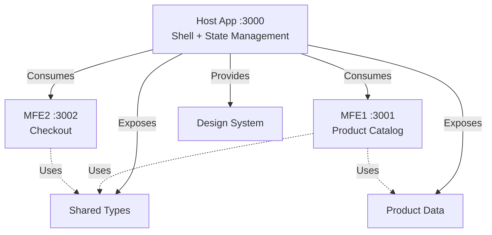

# React Microfrontends Store

A minimal e-commerce application built with React and Module Federation, demonstrating modern microfrontend architecture patterns.

## Architecture



### Application Structure

- **Host App** (`localhost:3000`) - Shell application with routing, global state (Zustand), and shared resources
- **MFE1** (`localhost:3001`) - Product catalog microfrontend with product grid and cart functionality
- **MFE2** (`localhost:3002`) - Checkout microfrontend with order form and summary

## Getting Started

### Prerequisites

```bash
node >= 18
pnpm >= 8
```

### Installation

```bash
pnpm install
```

### Development

Run all microfrontends simultaneously:

```bash
# Terminal 1 - Host (must start first)
cd host_app && pnpm dev

# Terminal 2 - Product Catalog
cd mfe1_app && pnpm dev

# Terminal 3 - Checkout
cd mfe2_app && pnpm dev
```

Open [http://localhost:3000](http://localhost:3000) to view the application.

### Build

```bash
# Build all apps
cd host_app && pnpm build
cd mfe1_app && pnpm build
cd mfe2_app && pnpm build
```

## Module Federation Configuration

### Host App Exposes

```typescript
exposes: {
  './types': './src/types/cart.ts',      // TypeScript interfaces
  './products': './src/data/products.ts', // Product data
}
```

### MFE1 Exposes

```typescript
exposes: {
  '.': './src/components/ProviderComponent.tsx', // Product catalog component
}
```

### MFE2 Exposes

```typescript
exposes: {
  '.': './src/components/Checkout.tsx', // Checkout component
}
```

## Technology Stack

- **React 18** - UI library
- **TypeScript** - Type safety
- **Module Federation** - Runtime microfrontend integration
- **Rsbuild** - Fast build tool
- **Zustand** - Lightweight state management
- **CSS Variables** - Design system tokens

## Project Structure

```
react-microfrontends/
├── host_app/           # Shell application
│   ├── src/
│   │   ├── theme.css          # Design system tokens
│   │   ├── types/cart.ts      # Shared TypeScript types
│   │   ├── data/products.ts   # Product catalog data
│   │   ├── store/             # Zustand store
│   │   └── App.tsx            # Main app with routing
│   └── module-federation.config.ts
├── mfe1_app/           # Product catalog MFE
│   ├── src/
│   │   └── components/
│   │       ├── ProviderComponent.tsx
│   │       └── ProviderComponent.css
│   └── module-federation.config.ts
└── mfe2_app/           # Checkout MFE
    ├── src/
    │   └── components/
    │       ├── Checkout.tsx
    │       └── Checkout.css
    └── module-federation.config.ts
```

## Development Notes

- Host must be running before starting remote apps
- All microfrontends share React and ReactDOM as singletons
- Theme CSS is loaded once from host and inherited by all remotes
- Type safety maintained across federation boundaries with TypeScript
- Each MFE can run standalone for development/testing

## Created With

```bash
pnpm create module-federation@latest
```

## License

MIT
