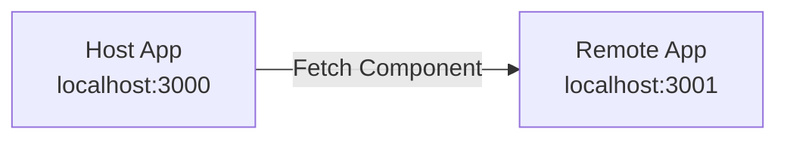

# React Microfrontends with Module Federation

```bash
pnpm create module-federation@latest
```

## Architecture



## Running

```bash
# Terminal 1
cd mfe1_app && pnpm dev

# Terminal 2
cd host_app && pnpm dev
```

**Host** imports components from **Remote** at runtime via Module Federation.
